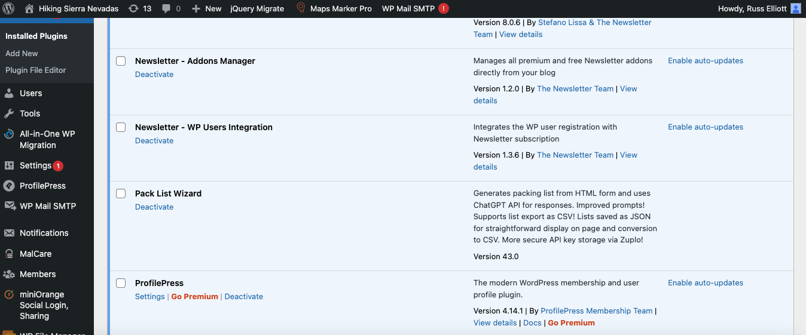

# Editing the "About" Tab on the Pack List Wizard
This outlines the process of editing the "About" Section of the Pack List Wizard, although this general process can be applied to modifying any section of the plugin.

## Editing the "About" Section
Go to a file edit/IDE of your choice and go to this section of code in `wizard.php` (line 261)
```html
<div  id="aboutContent"  class="section-content">
	Your desired "about" text goes here
</div>
```

## Updating the Plugin
Go into wp-admin to add the files and update the plugin

Next, go to WP File Manager. If you haven’t already, go to [wp-content -> plugins -> pack-list-wizard](https://www.sierrahiking.net/wp-admin/admin.php?page=wp_file_manager).

You should now see the following page:


From there, delete the files you modified and drag/drop them from your local file manager. Better yet, you can delete all of them from the WP File Manager and drag all the plugin files from your file manager in case you forgot which ones you modified.

Then, go to [wp-admin -> plugins](https://www.sierrahiking.net/wp-admin/plugins.php) and deactivate the plugin, then reactivate it again.

