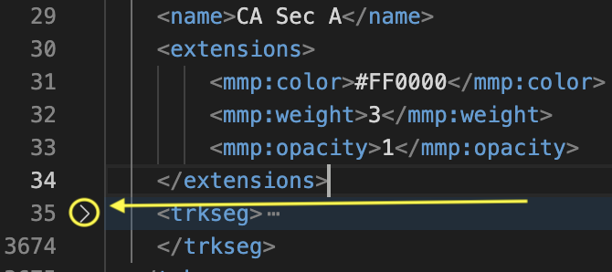

# Customize Trail Color in Maps Marker Pro
Here is how to have polylines of different colors on Maps Marker Pro.

This link below provides details of what to do.
https://www.mapsmarker.com/kb/user-guide/how-to-use-gpx-extensions-to-customize-tracks

Firstly, you need to add this section of code to the header of the file immediately after the first gpx tag
`xmlns:mmp="https://www.mapsmarker.com/GPX/1/"`

The header should look something like this:
```
<gpx xmlns:mmp="https://www.mapsmarker.com/GPX/1/" xmlns="http://www.topografix.com/GPX/1/1"
     creator="~lippke/PCT-2016/lol/P16 - Final GPX.ipynb" version="1.1"
     xmlns:xsi="http://www.w3.org/2001/XMLSchema-instance"
     xsi:schemaLocation="http://www.topografix.com/GPX/1/1
     http://www.topografix.com/GPX/1/1/gpx.xsd">

In the “extensions” area of the track, the code should have this structure
<extensions>
    <mmp:color>#FF0000</mmp:color>
    <mmp:weight>3</mmp:weight>
    <mmp:opacity>1</mmp:opacity>
</extensions>
```
For recoloring an entire trail, the content from the extensions section should be placed in the `<trk>` section. The overall trail syntax should look like this:
```
<trk>
   <name>CA Sec A</name>
   <extensions>
       <mmp:color>#FF0000</mmp:color>
       <mmp:weight>3</mmp:weight>
       <mmp:opacity>1</mmp:opacity>
   </extensions>
   <trkseg>
     ...
   </trkseg>
 </trk>
```

For recoloring a specific track segment, the content from the extensions section should be placed in the `<trkseg>` section. The overall syntax should look something like this:

```
<trk>
   <name>CA Sec A</name>
   ...
   <trkseg>
   <extensions>
            <mmp:color>#FF0000</mmp:color>
       	    <mmp:weight>3</mmp:weight>
       	    <mmp:opacity>1</mmp:opacity>
   </extensions>
    ...
  </trkseg>
 </trk>
```

I find it much easier to do these edits on VSCode. Next to the `<trkseg>` tag is an icon you can click an icon which collapses that element, saving you lots of scrolling.



## Trail Color Management
The trails are colored as a means to distingish each other to ensure the user knows when one starts and ends without the usage of markers to denote this. Colored markers will be used to denote the length of each trail.

### Useful Resources for Trail Color Management
HTML color visualizer: https://htmlcolorcodes.com/
Color Palette Generator: https://coolors.co/

## Marker Management
There are two ways to add a marker to a map. Go to "Maps Marker Pro" on the WordPress dashboard
1. Go into "List All Maps" and scroll down to the map in question. From there, select "Add Marker"
2. Go into "List All Markers", add a new marker, and specify which map it goes to in the "Maps" field

Unfortunately, when placing the markers on a map, you can't see the associated polylines for the trail. A good workaround for this is finding the starting coordinates of the trail by going into the GPX file and setting the marker's coordinates to that.